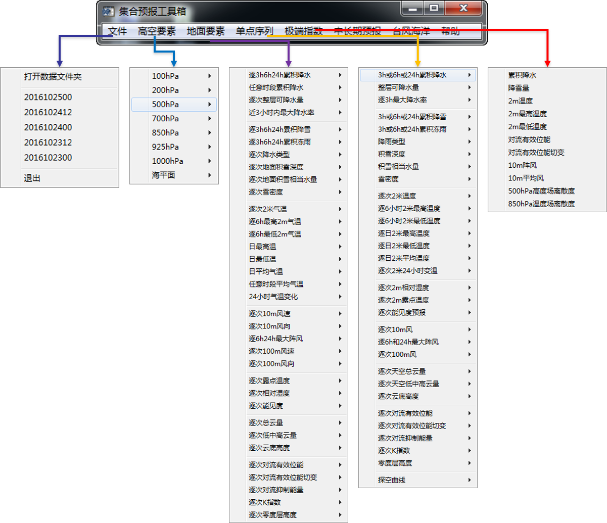
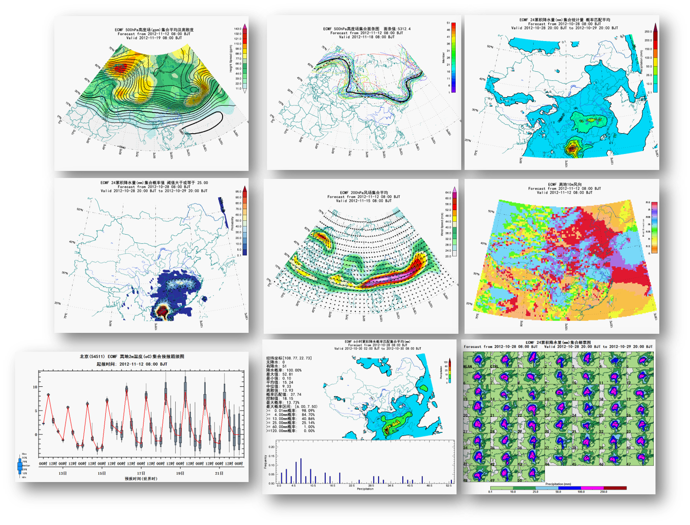

# NMC集合预报工具箱
NMC集合预报工具箱数据后处理程序以及前端界面程序.

<!-- -->
<!-- -->

* software/external, 外部支持程序库, 按照配置见software/nmc_ensemble_process/install_readme.txt
* software/nmc_ensemble_process, 不同集合模式的GRIB原始数据处理及集合预报衍生产品制作程序
* software/nmc_ensemble_toolkits, 交互式集合预报工具箱前端显示软件

若有问题, 请[留言](https://github.com/nmcdev/nmc_ens_toolkits/issues).

# Update:
* 2019年2月
  - 支持对GRAPES_GEPS集合预报GRIB数据的后处理及工具箱的前端显示.

* 2016年9月8日, 发布版本1.0
  - 对工具箱进行大幅度更新, 目前支持所有集合变量的显示, 如降水类型、能见度、阵风、高中低云量、不稳定指数等等.
  - 增加对单点降雨、冻雨、降雪和降水类型的概率直方图显示.
  - 修正了一些BUG，如对日最高、最低温的显示坐标轴偏移的问题.
  - 对菜单也进行重新整理.
  - 增加发布64位程序.
  - 在文件菜单下增加了最近几个时次的数据目录选取.

* 2016年8月31日
  - 增加对逐3小时数据的显示支持
  - 在配置文件中增加对地图文件的配置, 具体见配置文件中地图信息shapefile文件名及绘图属性设置

* 2014年9月28日
  - 变更集合预报服务器, 加入T639集合预报产品

* 2013年10月27日
  - 修正了箱须图和烟羽图中对于累积变量的鼠标选取错误.

* 2013年8月13日
  - 解决球面投影下地图重置出现的错误

* 2013年7月26日
  - 修正北半球地图投影的BUG

* 2013年7月23日
  - 增加ECMWF的月预报数据产品, 并添加相应文档
  - 采用IDL8.2.3版本
  - 将版本升级到0.6

* 2013年6月27日
  - 修正邮票图时间顺序的问题

* 2013年6月21日
  - 加入为地图加入“区县地图”选择按钮

* 2013年6月16日, 版本号升级为0.5, 主要升级如下:
    - 基于新的数据服务器, 数据预报时效得到更好保障
    - 采用IDL8.2.2版本, 图像更快显示
    - 增加加拿大(CMC), T213的集合预报产品
    - 增加欧洲中心极端天气指数产品, 包括降水, 温度, 阵风, 平均风速
    - 增加整层可降水量集合预报产品
    - 增加各地面和高空要素的集合预报烟羽图产品
    - 增加地面10m风的风向玫瑰图产品(在单点序列->逐次10m风菜单下)
    - 增加高空要素的集合预报箱线图产品
    - 增加10m风, 云, CAPE的任意点直方图产品
    - 转换模式数据集时, 不改变预报时效
    - 面条图等值线得到加粗
    - 处理由于面条图绘制错误而引起的程序退出
    - 针对邮票图界面增加更新按钮
    - 改进任意时段的集合平均和离散度产品(防止离散度的等值线值选取不当而形成大片空白区域)
    - 标题中采用模式全名称（如ecm->ECMWF）
    - 扩大地面和高空图的区域显示范围
    - 修改箱线图的时间坐标, 采用北京时
    - 箱线图增加控制预报曲线
    - 改进集合平均风向产品的颜色条

* 2012年11月14日
    - 改善几项填色等值线在冬季的不适用性
    - 加入NCEP集合预报数据
    - 版本号升级为0.4
    
* 2012年7月19日,
    - 重新修改了程序框架
    - 增加了延伸期时段的产品
    - 修改了面条图产品, 可以实现地图缩放
    - 补充了各变量的集合预报产品
    - 完善了数据目录打开方式, 实现如果数据目录中没有数据, 自动采用前一个时刻的数据
    - 实现可以在配置文件中设置地图范围
    - 完善了颜色条的显示方式, 采用分段颜色条
    - 完善了等值线的间隔, 颜色, 线条等设置
    - 增加了任意时段的集合概率预报产品
    - 将版本升级为0.3
    
* 2012年05月24日,
    - 平台由IDL8.1升级到IDL8.2
    
* 2012年04月30日,
    - 增加了任意时段的降水、高度场延伸期产品;

* 2012年04月29日,
    - 修正了发布程序中不能正确显示颜色表的错误;
    - 修正的标题拼写错误.
    
* 2012年03月30日,
    - 增加探空集合平均产品;
    
* 2012年03月28日,
    - 在配置文件中增加了中期选项medium_range = 1,
        用于某些图形的中期范围设置(如500hPa中期默认为北半球);
        
* 2012年03月24日,
    - 增加了850hPa比湿, 950hPa各变量短期, CAPE等集合预报产品;
    - 增加了可以任意取值的交互式的概率预报产品和界面
    
* 2012年03月20日,
    - 经过一段时间的业务运行, 系统较为稳定, 把版本升级为0.2;
    - 修正了不同直接对象窗口转换而丢失数据坐标的问题;
    - 增加了850hPa温度和湿度箱须图产品, 地面2m温度的面条图产品
    
* 2012年03月10日,
    - 将箱须图的轴线字体放大;
    - 修正了累积降水(雪)量的箱须图出现负值的情况;
    - 将概率匹配集合平均从单独的显示窗口转移到集合统计量里面.
    
* 2012年02月26日
    - 针对计算采用低端显卡而造成的程序异常退出的问题, 
      在配置文件中增加渲染选项
      RENDERER = 0 ; 采用硬件加速, 对硬件要求高, 速度较慢
      RENDERER = 1 ; 采用软件加速, 对硬件要求不高但速度较慢
   
* 2012年02月25日
    - 发布第一个业务试用版本0.1;
    
* 2012年03月23日,
    - 解决了时间翻页时地图范围重置的问题
